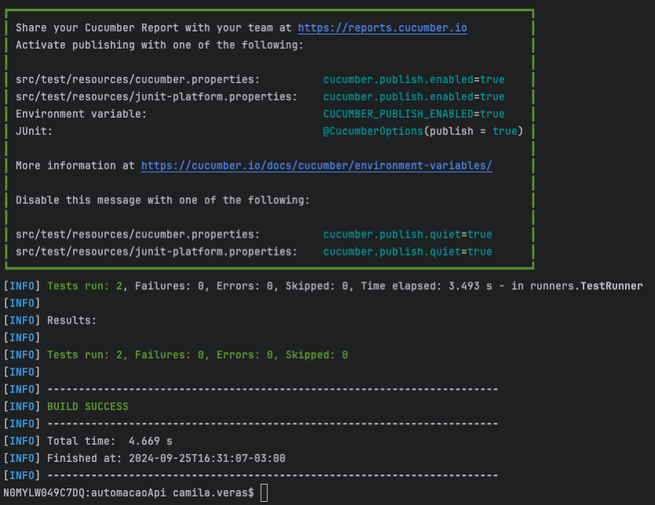
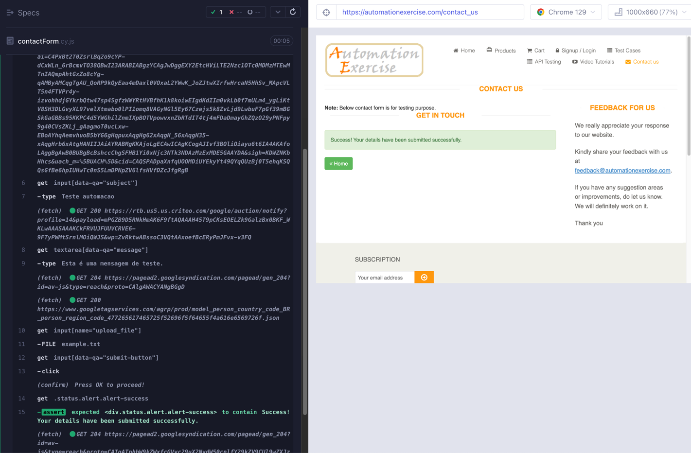

# Projeto de Automação - API e Front-End

Este projeto contém automações de testes para APIs (na pasta `automacaoApi`) e de front-end (na pasta `automacaoWeb`), utilizando as ferramentas **Rest Assured** e **Cypress**, respectivamente.

## Requisitos

- **Java 11** ou superior
- **Maven 3.6+**
- **Node.js** (para automação de front-end)
- **Cypress** (instalado via npm)

## Estrutura do Projeto

- `/automacaoApi/`: Código da automação de API
- `/automacaoWeb/`: Código da automação de front-end
- `/target/`: Saída dos relatórios de teste

## Configuração e Execução

### Automação de API (pasta `automacaoApi`)

1. **Instalar dependências:**
    - Certifique-se de ter o Maven instalado e configurado corretamente.
    - Na raiz do diretório `automacaoApi`, execute:
      ```bash
      mvn clean install
      ```

2. **Execução dos Testes de API:**
    - Para executar os testes da API entre em `automacaoApi`, e utilize:
      ```bash
      mvn test 
      ```
    - Imagem dos testes executados com sucesso:
    - 
3. **Relatórios:**
    - Os relatórios de teste serão gerados na pasta `/automacaoApi/target/surefire-reports`.

### Automação de Front-End (pasta `automacaoWeb`)

1. **Instalar dependências:**
    - Certifique-se de que o Node.js e o npm estão instalados.
    - Navegue até a pasta `/automacaoWeb` e execute:
      ```bash
      npm install
      ```


2**Abrir a Interface do Cypress:**
    - Caso queira abrir a interface interativa do Cypress, execute:
      ```bash
      npx cypress open
      ```
   - Imagem do local onde deve ser executado o comando:
   - 


    OBS: Caso o email ja tenha sido criado entre no arquivo userData.json e altere ele para um email que ainda não foi criado.

   - Imagem do teste executado com sucesso:

## Estrutura do Projeto

O projeto está organizado da seguinte forma:
- **/automacaoApi**: Contém os testes de API usando Rest Assured e o framework de testes Cucumber.
- **/automacaoWeb**: Contém os testes de front-end utilizando Cypress.
- **/target**: Relatórios de execução e resultados de testes.

## Boas Práticas

- Mantenha este README atualizado conforme mudanças nas dependências ou nas ferramentas utilizadas.
- Siga o padrão de nomenclatura e organização dos testes e classes.
- Cada automação deve ser mantida de forma modular, separando os testes de API e front-end para facilitar a manutenção e entendimento.

## Considerações Finais

- Contribuições são bem-vindas! Use o sistema de issues para reportar bugs ou sugerir melhorias.
- Qualquer dúvida ou sugestão pode ser compartilhada com a equipe de desenvolvimento.
